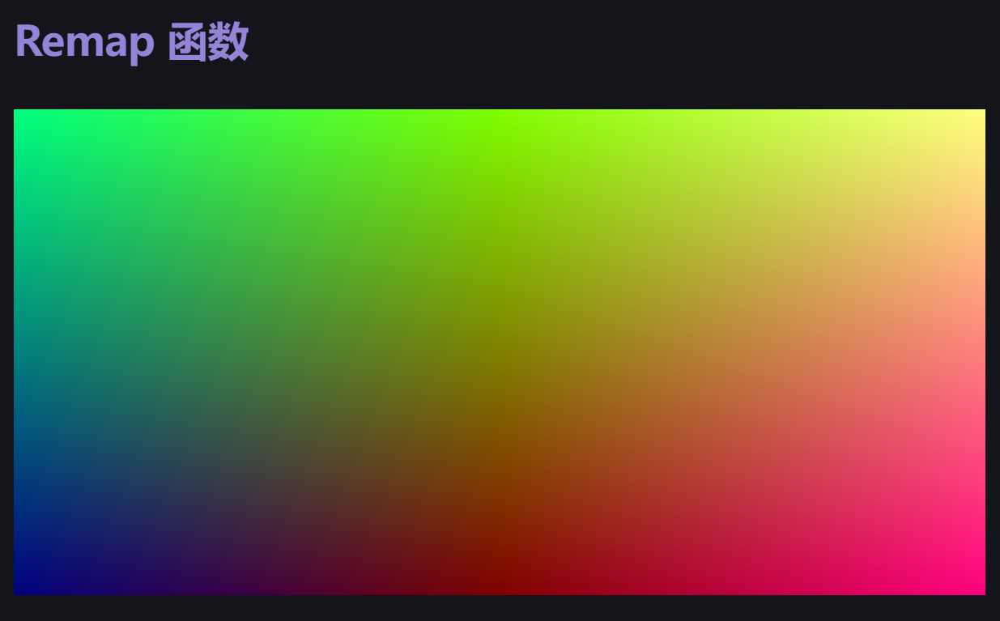

# Obsidian GLSL Render

## 描述信息
> 在 Obsidian 中编写 Shader

## 效果

```markdown
# Remap 函数

···glsl
#ifdef GL_ES
precision mediump float;
#endif

uniform vec2 u_resolution;
float remap(float x,float s, float e, float s1,float e1) {
return (x - s)/(e-s)*(e1-s1) + s1;
}

void main(){
vec2 uv = gl_FragCoord.xy/u_resolution.xy;

	float x = abs(remap(uv.x,0.,1.,-.5,.5));
	
	gl_FragColor = vec4(uv,x,1);

}
···
```
## 渲染效果

